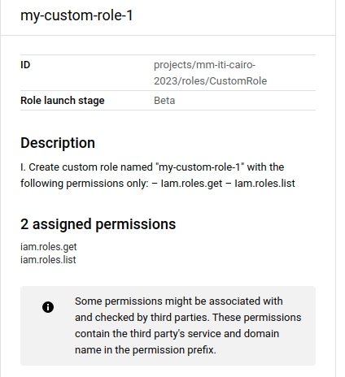
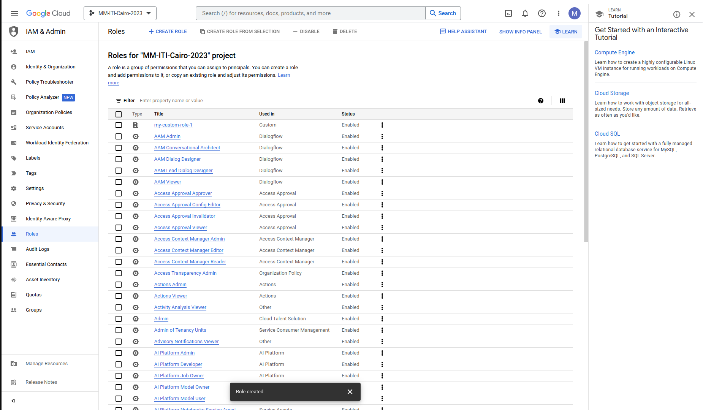
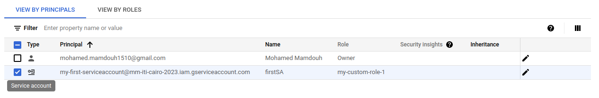
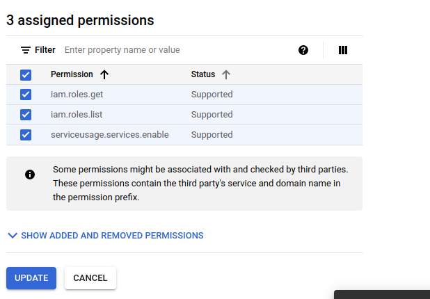
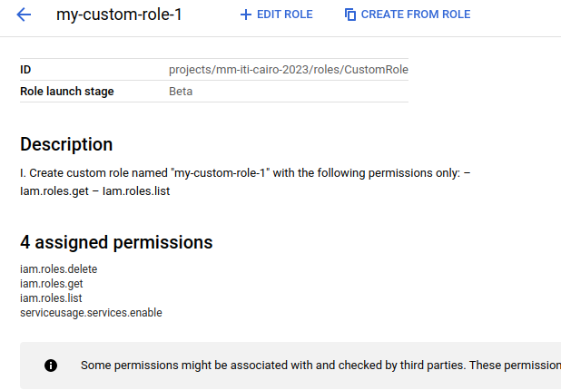

# Google Cloud Platform

## Lab1-2
---
---
## 1- From Cloud console, do the following:
- Create custom role named "my-custom-role-1" with the following permissions only:
    - Iam.roles.get
    - Iam.roles.list
<!-- permission assigned to role and role assigned to identity , role is collection of permission -->


---
## 2- From Cloud console, Explore primitive and pre-defined roles and their permissions.


---
## 3- From Cloud console, Create a service account with id "my-first-serviceaccount".
## 4- From Cloud console, Assign the custom role "my-custom-role-1" to the service account "my-first-
serviceaccount" 


---
## 5.Using gcloud,
1. List all roles on your project.
```bash
$ gcloud iam roles list --project mm-iti-cairo-2023 
---
description: |-
  I.
  Create custom role named "my-custom-role-1" with the following permissions only:
  – Iam.roles.get
  – Iam.roles.list
etag: BwXzAksJOdo=
name: projects/mm-iti-cairo-2023/roles/CustomRole
stage: BETA
title: my-custom-role-1
```
---
2. Describe the predefined role "roles/compute.viewer" and view its details & permissions
```bash
$ gcloud iam roles describe roles/compute.viewer
description: Read-only access to get and list information about all Compute Engine
  resources, including instances, disks, and firewalls. Allows getting and listing
  information about disks, images, and snapshots, but does not allow reading the data
  stored on them.
etag: AA==
includedPermissions:
- compute.acceleratorTypes.get
- compute.acceleratorTypes.list
- compute.addresses.get

# alot of permissions

- serviceusage.services.get
- serviceusage.services.list
name: roles/compute.viewer
stage: GA
title: Compute Viewer
```
---
3. Describe the custom role "my-custom-role-1" and view its details & permissions.
CustomRole = Role ID
```bash
$ gcloud iam roles describe CustomRole --project=mm-iti-cairo-2023 
description: |-
  I.
  Create custom role named "my-custom-role-1" with the following permissions only:
  – Iam.roles.get
  – Iam.roles.list
etag: BwXzAksJOdo=
includedPermissions:
- iam.roles.get
- iam.roles.list
name: projects/mm-iti-cairo-2023/roles/CustomRole
stage: BETA
title: my-custom-role-1
```
---
4. List all authenticated accounts.
```bash
$ gcloud auth list
        Credentialed Accounts
ACTIVE  ACCOUNT
*       XXXXXXXX@gmail.com

To set the active account, run:
    $ gcloud config set account `ACCOUNT`
```
---
5. Activate the service account "my-first-serviceaccount".
```bash
$ gcloud auth activate-service-account --key-file=/media/mmamdouh/new-Partation/iti-newpart/GCP/Day1/mm-iti-cairo-2023-3d6038aa7725.json
Activated service account credentials for: [my-first-serviceaccount@mm-iti-cairo-2023.iam.gserviceaccount.com]
```
---
6. List all authenticated accounts again.
```bash
$ gcloud auth list
                          Credentialed Accounts
ACTIVE  ACCOUNT
        XXXXXXXX@gmail.com
*       my-first-serviceaccount@mm-iti-cairo-2023.iam.gserviceaccount.com

To set the active account, run:
    $ gcloud config set account `ACCOUNT`
```
---
7. Using this service account, try to list all roles on your project.
```bash
$ gcloud config set account my-first-serviceaccount@mm-iti-cairo-2023.iam.gserviceaccount.com
Updated property [core/account].
```
```bash
$ gcloud iam roles list --project mm-iti-cairo-2023
API [iam.googleapis.com] not enabled on project [999550456219]. Would you like to enable and retry (this will take a few minutes)? 
(y/N)?  y

Enabling service [iam.googleapis.com] on project [999550456219]...
ERROR: (gcloud.iam.roles.list) PERMISSION_DENIED: Permission denied to enable service [iam.googleapis.com]
Help Token: AVUsNs07p10NiBVj1X_rDwMFtK2PnIHvuxfHvdHVYqagHIedMUTs3wX1sUKAMcPdHlFr7oTCUp1IgvIXmRkA_5NLTR10ykuUZ1AzzkP6hQ2Ru_JK
- '@type': type.googleapis.com/google.rpc.PreconditionFailure
  violations:
  - subject: ?error_code=110002&service=serviceusage.googleapis.com&permission=serviceusage.services.enable&resource=999550456219
    type: googleapis.com
- '@type': type.googleapis.com/google.rpc.ErrorInfo
  domain: serviceusage.googleapis.com
  metadata:
    permission: serviceusage.services.enable
    resource: '999550456219'
    service: serviceusage.googleapis.com
  reason: AUTH_PERMISSION_DENIED
```
## **Add Serviceusage.services.enable to  "my-custom-role-1" using GCP Console**



```bash
$ gcloud iam roles list --project mm-iti-cairo-2023
API [iam.googleapis.com] not enabled on project [999550456219]. Would you like to enable and retry (this will take a few minutes)? 
(y/N)?  y    

Enabling service [iam.googleapis.com] on project [999550456219]...
Operation "operations/acat.p2-999550456219-f71fb32e-a7d1-42c2-9a35-f7780a1b0453" finished successfully.
---
description: |-
  I.
  Create custom role named "my-custom-role-1" with the following permissions only:
  – Iam.roles.get
  – Iam.roles.list
etag: BwXzA3fxIYk=
name: projects/mm-iti-cairo-2023/roles/CustomRole
stage: BETA
title: my-custom-role-1
```
---
8. Try to delete custom role "my-custom-role-1"

```bash
$ gcloud iam roles delete CustomRole --project=mm-iti-cairo-2023
ERROR: (gcloud.iam.roles.delete) PERMISSION_DENIED: You don't have permission to delete the role at (projects/mm-iti-cairo-2023/roles/CustomRole).
```
## **Add iam.roles.delete to  "my-custom-role-1" using GCP Console**



```bash
$ gcloud iam roles delete CustomRole --project=mm-iti-cairo-2023
deleted: true
description: |-
  I.
  Create custom role named "my-custom-role-1" with the following permissions only:
  – Iam.roles.get
  – Iam.roles.list
etag: BwXzA9s-9qU=
includedPermissions:
- iam.roles.delete
- iam.roles.get
- iam.roles.list
- serviceusage.services.enable
name: projects/mm-iti-cairo-2023/roles/CustomRole
stage: BETA
title: my-custom-role-1
```
