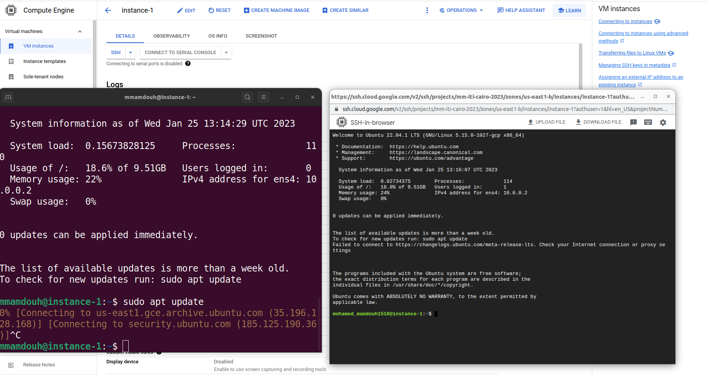
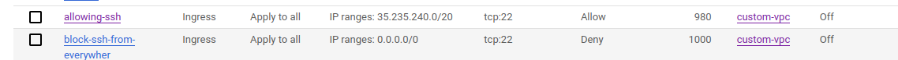
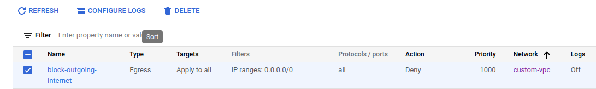
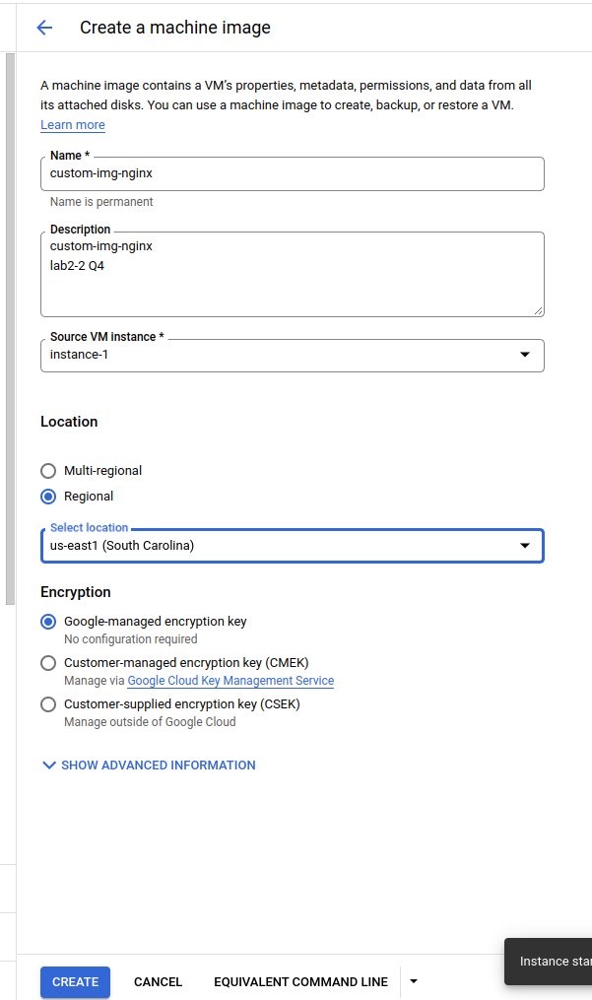

# Google Cloud Platform

## Lab2-2
---
---
## Create a VM with public ip then:
### 1. In two different ways, SSH into this VM.


### 2. –Enforce SSH into this VM to be IAP protected.

#### - adding of firewall rules to deny ssh from everywhere and allow it through IAP Only


#### - when i use 
```bash
$ gcloud compute ssh instance-1 --project=mm-iti-cairo-2023
```
#### - i will get timeout because i am blocked due to the firewall rule
#### - so i must ssh through IAP tunnel
```bash
$ gcloud compute ssh instance-1 --project=mm-iti-cairo-2023 --tunnel-through-iap
No zone specified. Using zone [us-east1-b] for instance: [instance-1].
WARNING: 

To increase the performance of the tunnel, consider installing NumPy. For instructions,
please see https://cloud.google.com/iap/docs/using-tcp-forwarding#increasing_the_tcp_upload_bandwidth

Welcome to Ubuntu 22.04.1 LTS (GNU/Linux 5.15.0-1027-gcp x86_64)

 * Documentation:  https://help.ubuntu.com
 * Management:     https://landscape.canonical.com
 * Support:        https://ubuntu.com/advantage

  System information as of Wed Jan 25 13:45:01 UTC 2023

  System load:  0.09033203125     Processes:             106
  Usage of /:   18.8% of 9.51GB   Users logged in:       0
  Memory usage: 22%               IPv4 address for ens4: 10.0.0.2
  Swap usage:   0%


0 updates can be applied immediately.


The list of available updates is more than a week old.
To check for new updates run: sudo apt update
Failed to connect to https://changelogs.ubuntu.com/meta-release-lts. Check your Internet connection or proxy settings


Last login: Wed Jan 25 13:14:33 2023 from 197.42.160.248
mmamdouh@instance-1:~$ 

```

## 3- Create a VM with public ip then:
### - SSH into this vm
#### - to do so i must revert setting in Q1-2 or i just go with IAP Tunnel
```bash
$ gcloud compute ssh instance-1 --project=mm-iti-cairo-2023 --tunnel-through-iap
```
---
### - Update system packages.
#### - i must remove the blocking outgoing rule in firewall,  from lab2-1


```bash
$ sudo apt update
```
---
### - Setup Nginx Web Server and test your setup.
```bash
sudo apt install -y nginx
```
```bash
sudo echo "hello from nginx page on VM Instance from GCP Lab2-2-Q4" > /var/www/html/index.html
```
```bash
$ curl localhost
hello from nginx page on VM Instance from GCP Lab2-2-Q4
```
### - Create a custom image from this VM named “custom-img-nginx”..


