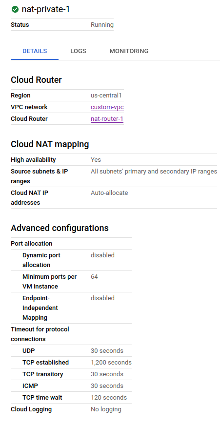

# Google Cloud Platform
## Lab3-1

## 1. In previous lab you created the VPC “auto-vpc”, How many routes created for this VPC? Can you delete any of these routes?
### - 36 route (1 for each subnet which are 35 subnet + 1 default to internet)
### - **Local routes cannot be deleted** , no i cannot
---
## 2. In previous lab you created a VPC named “custom-vpc” How many routes created for this VPC?
### - 3 routes (1 for each subnet and 1 default to the internet )
---
## 3. How would you block internet access from you vpc using routes?
### - by deleting the internet gateway route 
## 4. Add a NAT gateway on any of the subnets in your VPC.

