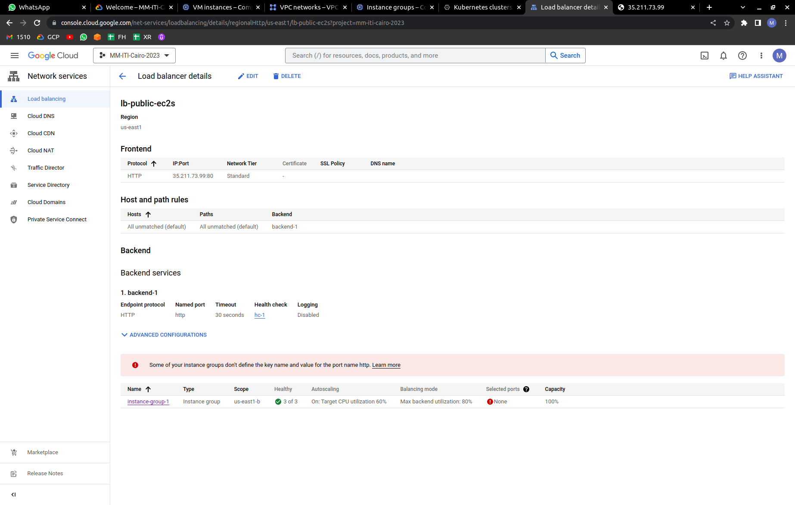
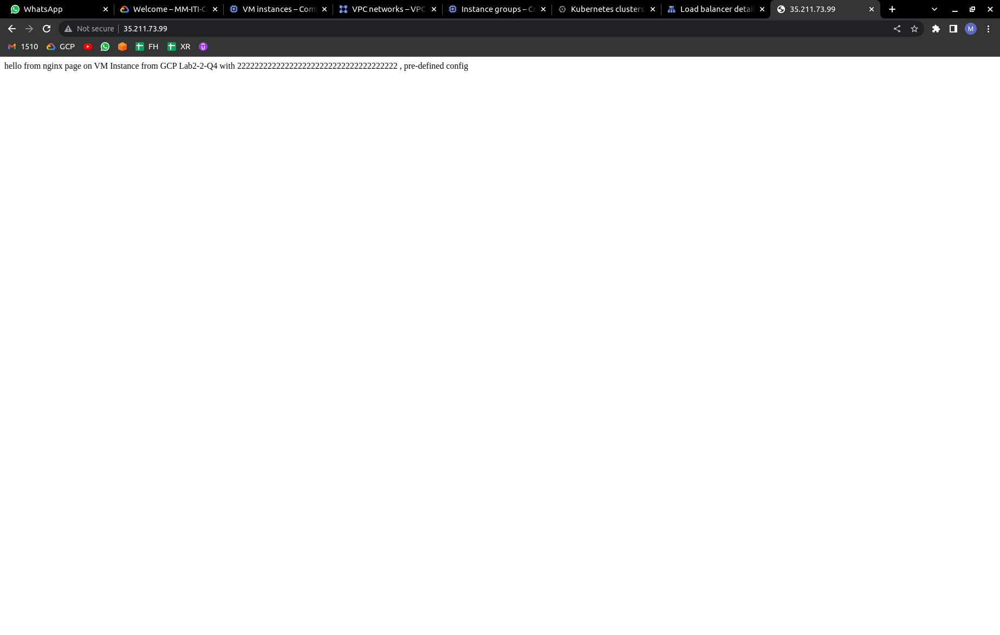
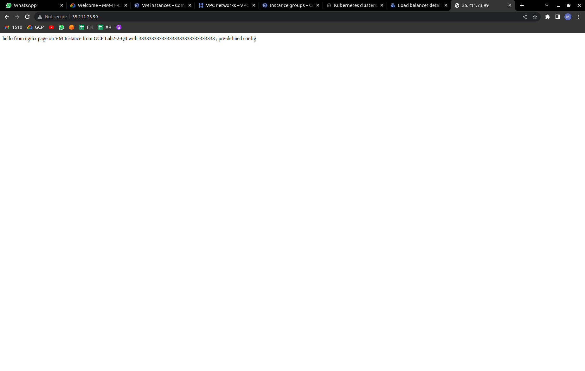

# Google Cloud Platform
## Lab3-2
---
## 1- In previous lab you created an MIG of a template using the custom image “custom-img-nginx”, Create a Global (or Regional) HTTP Load balancer to access your MIGs Nginx setup.

---

---

---

## 2- Try to configure IAP at the load balancer level to protect your ingress access. Is it possible to have IAP enabled for HTTP resources?

