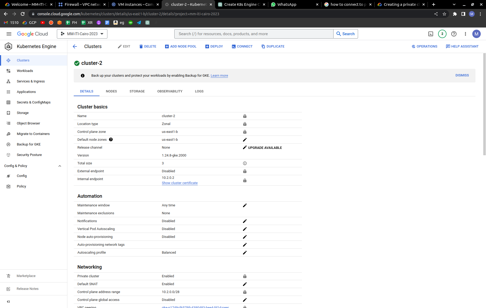
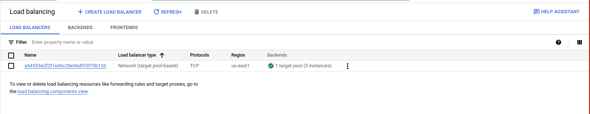
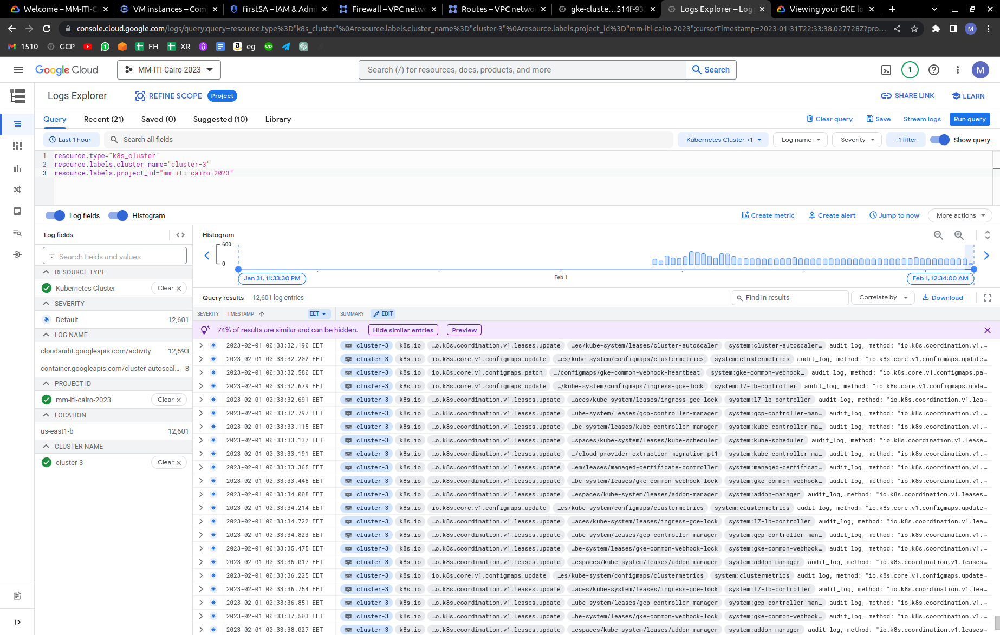
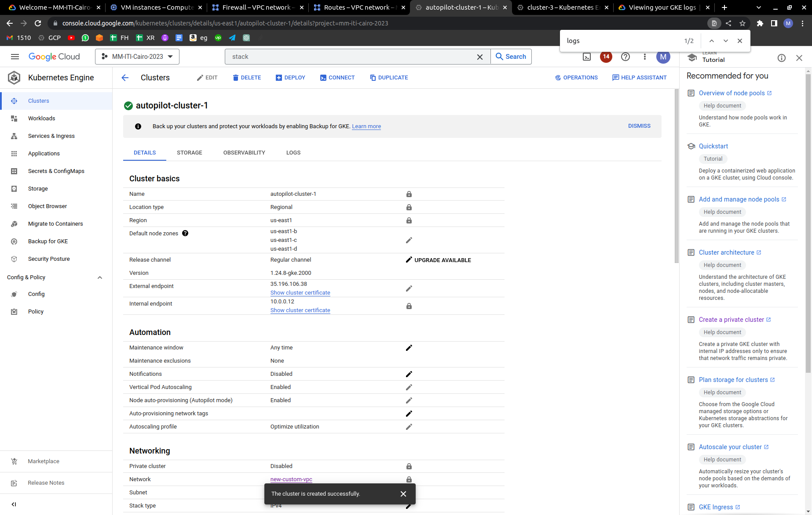
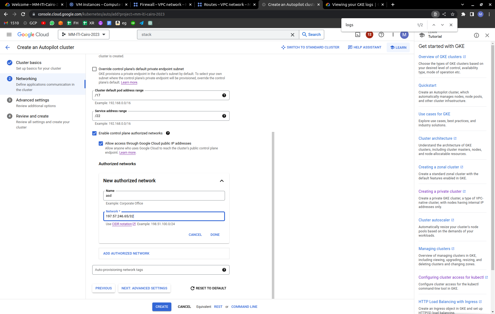

# Google Cloud Platform
## Lab3-3
---

## 1- Create a private GKE cluster.


## 2- Deploy Nginx as a deployment using latest Nginx docker image on Docker Hub.
```bash
$ kubectl get deployment
NAME      READY   UP-TO-DATE   AVAILABLE   AGE
nginx-1   3/3     3            3           27m
```
## 3- Expose your Nginx deployment using Kubernetes LoadBalancer Service.
```bash
$ k get service
NAME              TYPE           CLUSTER-IP    EXTERNAL-IP     PORT(S)        AGE
kubernetes        ClusterIP      10.84.0.1     <none>          443/TCP        77m
nginx-1-service   LoadBalancer   10.84.9.222   104.196.2.232   80:32267/TCP   66m
```
## 4- What is the type of GCP Load Balancer that is created for your LB service?


## 5- Use kubectl to view container logs.
```bash
mmamdouh@mmamdouh:~$ k get pods
NAME                       READY   STATUS    RESTARTS   AGE
nginx-1-5775447459-2h7gq   1/1     Running   0          69m
nginx-1-5775447459-444sk   1/1     Running   0          69m
nginx-1-5775447459-mq7db   1/1     Running   0          69m
```
```bash
mmamdouh@mmamdouh:~$ k logs nginx-1-5775447459-2h7gq
/docker-entrypoint.sh: /docker-entrypoint.d/ is not empty, will attempt to perform configuration
/docker-entrypoint.sh: Looking for shell scripts in /docker-entrypoint.d/
/docker-entrypoint.sh: Launching /docker-entrypoint.d/10-listen-on-ipv6-by-default.sh
10-listen-on-ipv6-by-default.sh: info: Getting the checksum of /etc/nginx/conf.d/default.conf
10-listen-on-ipv6-by-default.sh: info: Enabled listen on IPv6 in /etc/nginx/conf.d/default.conf
/docker-entrypoint.sh: Launching /docker-entrypoint.d/20-envsubst-on-templates.sh
/docker-entrypoint.sh: Launching /docker-entrypoint.d/30-tune-worker-processes.sh
/docker-entrypoint.sh: Configuration complete; ready for start up
2023/01/31 22:18:35 [notice] 1#1: using the "epoll" event method
2023/01/31 22:18:35 [notice] 1#1: nginx/1.23.3
2023/01/31 22:18:35 [notice] 1#1: built by gcc 10.2.1 20210110 (Debian 10.2.1-6) 
2023/01/31 22:18:35 [notice] 1#1: OS: Linux 5.15.0-1020-gke
2023/01/31 22:18:35 [notice] 1#1: getrlimit(RLIMIT_NOFILE): 1048576:1048576
2023/01/31 22:18:35 [notice] 1#1: start worker processes
2023/01/31 22:18:35 [notice] 1#1: start worker process 29
2023/01/31 22:18:35 [notice] 1#1: start worker process 30
10.0.0.10 - - [31/Jan/2023:23:16:31 +0000] "GET / HTTP/1.1" 200 615 "-" "Linux Gnu (cow)" "-"
```
## 6- Use cloud logging service to view container logs. [hint: search about cloud logging service for gke]


## 7- (Bonus) setup a HTTP load balancer for your deployment using the kubernetes ingress resource. (hint: link)
## 8- Create an autopilot GKE cluster with public control plane.


## 9- Enforce the cluster’s control plane to accept only connections from your local machine.


## 10- .Install kubectl on local machine and use it to connect to the cluster.
```bash
$ sudo apt install kubectl
[sudo] password for mmamdouh: 
Reading package lists... Done
Building dependency tree... Done
Reading state information... Done
The following NEW packages will be installed
  kubectl
0 to upgrade, 1 to newly install, 0 to remove and 48 not to upgrade.
Need to get 10.1 MB of archives.
After this operation, 48.0 MB of additional disk space will be used.
Get:1 https://packages.cloud.google.com/apt cloud-sdk/main amd64 kubectl amd64 1.26.1-00 [10.1 MB]
Fetched 10.1 MB in 3s (3,030 kB/s)  
Selecting previously unselected package kubectl.
(Reading database ... 293927 files and directories currently installed.)
Preparing to unpack .../kubectl_1.26.1-00_amd64.deb ...
Unpacking kubectl (1.26.1-00) ...
Setting up kubectl (1.26.1-00) ...
```

```bash
mmamdouh@mmamdouh:~$ gcloud container clusters get-credentials autopilot-cluster-1 --region=us-east1 --project=mm-iti-cairo-2023
Fetching cluster endpoint and auth data.
kubeconfig entry generated for autopilot-cluster-1.
```
```bash
mmamdouh@mmamdouh:~$ kubectl get all
NAME                 TYPE        CLUSTER-IP     EXTERNAL-IP   PORT(S)   AGE
service/kubernetes   ClusterIP   10.170.128.1   <none>        443/TCP   8m35s
```
