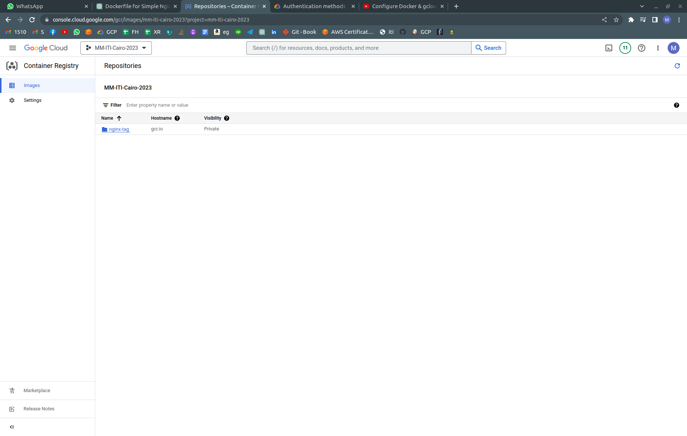
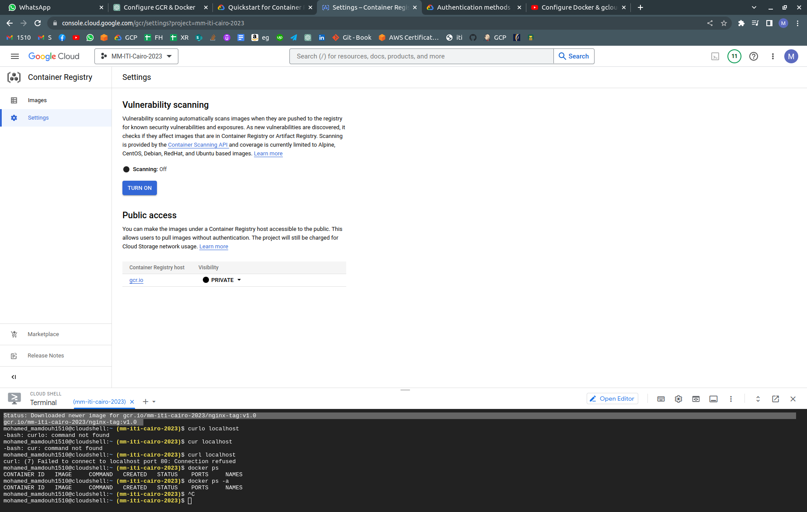
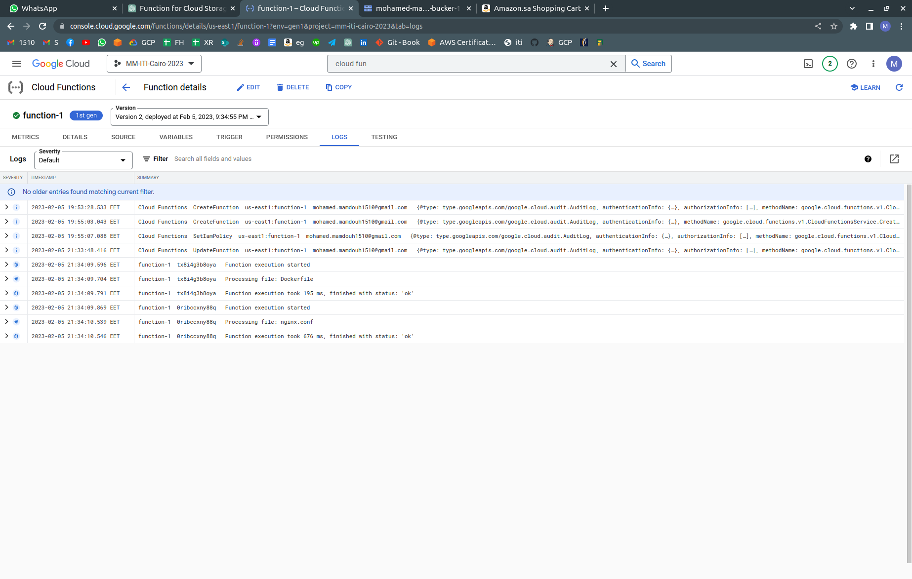
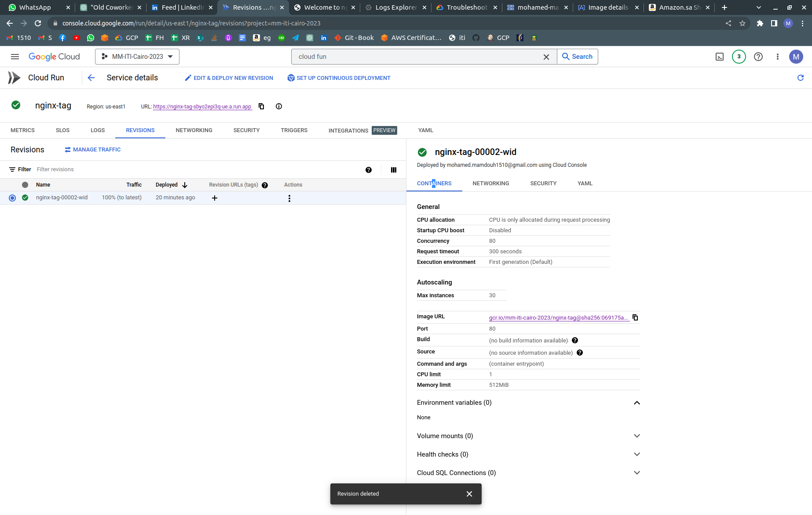
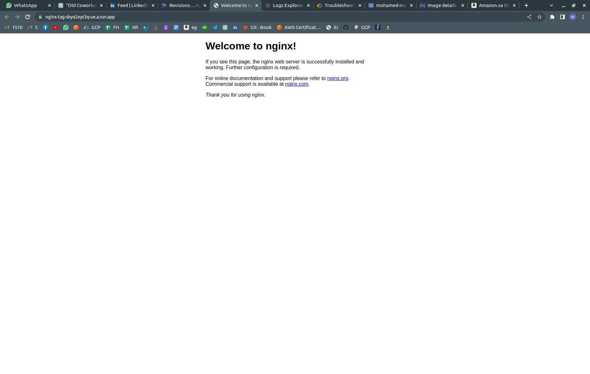
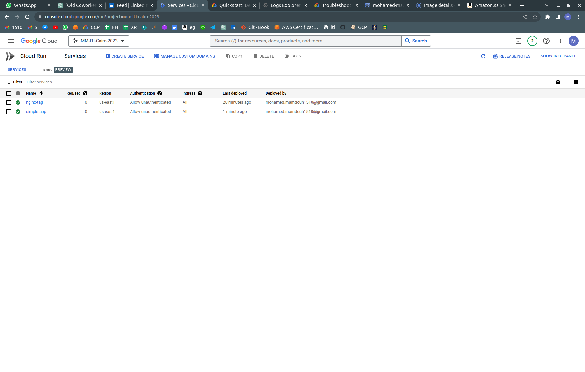
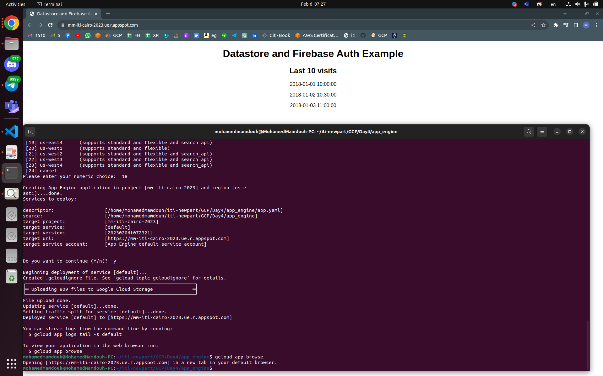

# Google Cloud Platform

## Lab 4-1

## 1. Using gcloud & Docker

## - Configure Docker & gcloud to work with GCR of your project. [hint: link]

```bash
$ gcloud auth configure-docker
WARNING: Your config file at [/home/mohamedmamdouh/.docker/config.json] contains these credential helper entries:

{
  "credHelpers": {
    "gcr.io": "gcloud",
    "us.gcr.io": "gcloud",
    "eu.gcr.io": "gcloud",
    "asia.gcr.io": "gcloud",
    "staging-k8s.gcr.io": "gcloud",
    "marketplace.gcr.io": "gcloud"
  }
}
Adding credentials for all GCR repositories.
WARNING: A long list of credential helpers may cause delays running 'docker build'. We recommend passing the registry name to configure only the registry you are using.
gcloud credential helpers already registered correctly.

```

## - Push Nginx docker image to GCR (make the image private)

## **Docker file locate in gcr_demo**

```bash
$ docker build -t nginx-tag .
[+] Building 21.3s (7/7) FINISHED
.
.
.
.

 => => writing image sha256:0fcc41a6d65e719f2f15165792fbb79919f86f7279548981f8c29b4586c128c1          0.0s
 => => naming to docker.io/library/nginx-tag                                                          0.0s
 ```

 ```bash
$ docker images
REPOSITORY              TAG       IMAGE ID       CREATED         SIZE
nginx-tag               latest    0fcc41a6d65e   2 minutes ago   142MB
mmamdouh996/test        v1.0      bd19b0df7af2   14 hours ago    922MB
mohamedmamdouhiv/test   v1.0      bd19b0df7af2   14 hours ago    922MB
jenkins_docker          latest    6d3e52fdcc69   14 hours ago    679MB
jenkins/jenkins         lts       3875608bd391   5 days ago      468MB
hello-world             latest    feb5d9fea6a5   16 months ago   13.3kB
```

```bash
docker tag 0fcc gcr.io/mm-iti-cairo-2023/nginx-tag:v1.0
```

```bash
$ docker push gcr.io/mm-iti-cairo-2023/nginx-tag:v1.0
The push refers to repository [gcr.io/mm-iti-cairo-2023/nginx-tag]
b1dfae7f6761: Pushed 
8342f56cc886: Layer already exists 
b74ced7dfeca: Layer already exists 
50ec2edf53d1: Layer already exists 
1341eea4a0c3: Layer already exists 
384534ba6a14: Layer already exists 
bd2fe8b74db6: Layer already exists 
v1.0: digest: sha256:069175a8534c28dfec8851e57138b0947487ba5ab99d7ba2679ed57ba9998b84 size: 1777
```




## - Pull this image into a k8s setup or on a VM (hint: attach a SA on ur vm or gke with correct iam role)

```bash
mohamed_mamdouh1510@cloudshell:~ (mm-iti-cairo-2023)$ docker pull gcr.io/mm-iti-cairo-2023/nginx-tag:v1.0
v1.0: Pulling from mm-iti-cairo-2023/nginx-tag
01b5b2efb836: Pull complete
db354f722736: Pull complete
abb02e674be5: Pull complete
214be53c3027: Pull complete
a69afcef752d: Pull complete
625184acb94e: Pull complete
b5ab7a6d6342: Pull complete
Digest: sha256:069175a8534c28dfec8851e57138b0947487ba5ab99d7ba2679ed57ba9998b84
Status: Downloaded newer image for gcr.io/mm-iti-cairo-2023/nginx-tag:v1.0
gcr.io/mm-iti-cairo-2023/nginx-tag:v1.0
```

## 2. Using Cloud Functions

## - Create a Function that runs whenever a file is uploaded to a cloud storage bucket. [hint: link]



## 3. Using Cloud Run

## - Run a pre-built docker image (pulled from GCR) [hint: link]




## - Build and Run any sample app [hint: link]

### **REF : <https://cloud.google.com/run/docs/quickstarts/build-and-deploy/deploy-python-service>**

**files are in the repo attached**


```bash
$ gcloud run deploy
Deploying from source. To deploy a container use [--image]. See https://cloud.google.com/run/docs/deploying-source-code for more details.
Source code location (/home/mohamedmamdouh/iti-newpart/GCP/Day4/simple-app):  
Next time, use `gcloud run deploy --source .` to deploy the current directory.

Service name (simple-app):  
rPlease specify a region:
 [1] asia-east1
 [2] asia-east2
 [3] asia-northeast1
 [4] asia-northeast2
 [5] asia-northeast3
 [6] asia-south1
 [7] asia-south2
 [8] asia-southeast1
 [9] asia-southeast2
 [10] australia-southeast1
 [11] australia-southeast2
 [12] europe-central2
 [13] europe-north1
 [14] europe-southwest1
 [15] europe-west1
 [16] europe-west2
 [17] europe-west3
 [18] europe-west4
 [19] europe-west6
 [20] europe-west8
 [21] europe-west9
 [22] me-west1
 [23] northamerica-northeast1
 [24] northamerica-northeast2
 [25] southamerica-east1
 [26] southamerica-west1
 [27] us-central1
 [28] us-east1
 [29] us-east4
 [30] us-east5
 [31] us-south1
 [32] us-west1
 [33] us-west2
 [34] us-west3
 [35] us-west4
 [36] cancel
Please enter numeric choice or text value (must exactly match list item):  28
Please enter a value between 1 and 36, or a value present in the list:  28

To make this the default region, run `gcloud config set run/region us-east1`.

API [artifactregistry.googleapis.com] not enabled on project [999550456219]. 
Would you like to enable and retry (this will take a few minutes)? (y/N)?  y

Enabling service [artifactregistry.googleapis.com] on project [999550456219]...
Operation "operations/acat.p2-999550456219-64aaedd2-0565-40d6-b0dc-c6314030d1df" finished successfully.
Deploying from source requires an Artifact Registry Docker repository to store 
built containers. A repository named [cloud-run-source-deploy] in region 
[us-east1] will be created.

Do you want to continue (Y/n)?  y

This command is equivalent to running `gcloud builds submit --tag [IMAGE] /home/mohamedmamdouh/iti-newpart/GCP/Day4/simple-app` and `gcloud run deploy simple-app --image [IMAGE]`

Allow unauthenticated invocations to [simple-app] (y/N)?  y

Building using Dockerfile and deploying container to Cloud Run service [simple-app] in project [mm-iti-cairo-2023] region [us-east1]
✓ Building and deploying new service... Done.                                  
  ✓ Creating Container Repository...                                           
  ✓ Uploading sources...                                                       
  ✓ Building Container... Logs are available at [https://console.cloud.google.c
  om/cloud-build/builds/3fe08b2d-b461-44d5-be16-58e0d7ea15cd?project=9995504562
  19].                                                                         
  ✓ Creating Revision... Revision deployment finished. Checking container healt
  h.                                                                           
  ✓ Routing traffic...                                                         
  ✓ Setting IAM Policy...                                                      
Done.                                                                          
Service [simple-app] revision [simple-app-00001-vix] has been deployed and is serving 100 percent of traffic.
Service URL: https://simple-app-sbyo2epi3q-ue.a.run.app

```

## 4. Using App Engine

## – Run the sample hello-world python app

## Creating project files and deploying it following steps in

### **REF : <https://cloud.google.com/appengine/docs/standard/python3/building-app/writing-web-service>**



```bash
 vim app.yaml
$ vim main.py
$ vim requirementes.txt
$ mkdir templates
$ cd templates/
$ touch index.html
$ vim index.html 
$ cd ..
$ mkdir static
$ cd static/
$ vim script.js
$ vim style.css
$ cd ..
$ python3 -m venv env ;source env/bin/activate

$ python3 -m venv env
source env/bin/activate
$ pip install -r requirements.txt
Collecting Flask==2.1.0
  Downloading Flask-2.1.0-py3-none-any.whl (95 kB)
     ━━━━━━━━━━━━━━━━━━━━━━━━━━━━━━━━━━━━━━━━ 95.2/95.2 KB 1.2 MB/s eta 0:00:00
Collecting Werkzeug>=2.0
  Downloading Werkzeug-2.2.2-py3-none-any.whl (232 kB)
     ━━━━━━━━━━━━━━━━━━━━━━━━━━━━━━━━━━━━━━━ 232.7/232.7 KB 2.9 MB/s eta 0:00:00
Collecting click>=8.0
  Downloading click-8.1.3-py3-none-any.whl (96 kB)
     ━━━━━━━━━━━━━━━━━━━━━━━━━━━━━━━━━━━━━━━━ 96.6/96.6 KB 3.8 MB/s eta 0:00:00
Collecting Jinja2>=3.0
  Downloading Jinja2-3.1.2-py3-none-any.whl (133 kB)
     ━━━━━━━━━━━━━━━━━━━━━━━━━━━━━━━━━━━━━━━ 133.1/133.1 KB 3.4 MB/s eta 0:00:00
Collecting itsdangerous>=2.0
  Downloading itsdangerous-2.1.2-py3-none-any.whl (15 kB)
Collecting MarkupSafe>=2.0
  Downloading MarkupSafe-2.1.2-cp310-cp310-manylinux_2_17_x86_64.manylinux2014_x86_64.whl (25 kB)
Installing collected packages: MarkupSafe, itsdangerous, click, Werkzeug, Jinja2, Flask
Successfully installed Flask-2.1.0 Jinja2-3.1.2 MarkupSafe-2.1.2 Werkzeug-2.2.2 click-8.1.3 itsdangerous-2.1.2
```

```bash
$ python main.py
 * Serving Flask app 'main' (lazy loading)
 * Environment: production
   WARNING: This is a development server. Do not use it in a production deployment.
   Use a production WSGI server instead.
 * Debug mode: on
WARNING: This is a development server. Do not use it in a production deployment. Use a production WSGI server instead.
 * Running on http://127.0.0.1:8080
Press CTRL+C to quit
 * Restarting with stat
 * Debugger is active!
 * Debugger PIN: 798-567-523
127.0.0.1 - - [06/Feb/2023 07:21:15] "GET / HTTP/1.1" 200 -
127.0.0.1 - - [06/Feb/2023 07:21:15] "GET /static/script.js HTTP/1.1" 200 -
127.0.0.1 - - [06/Feb/2023 07:21:15] "GET /static/style.css HTTP/1.1" 200 -
127.0.0.1 - - [06/Feb/2023 07:21:15] "GET /favicon.ico HTTP/1.1" 404 -
```

```bash
$ vim app.yaml
$ gcloud app deploy
You are creating an app for project [mm-iti-cairo-2023].
WARNING: Creating an App Engine application for a project is irreversible and the region
cannot be changed. More information about regions is at
<https://cloud.google.com/appengine/docs/locations>.

Please choose the region where you want your App Engine application located:

 [1] asia-east1    (supports standard and flexible)
 [2] asia-east2    (supports standard and flexible and search_api)
 [3] asia-northeast1 (supports standard and flexible and search_api)
 [4] asia-northeast2 (supports standard and flexible and search_api)
 [5] asia-northeast3 (supports standard and flexible and search_api)
 [6] asia-south1   (supports standard and flexible and search_api)
 [7] asia-southeast1 (supports standard and flexible)
 [8] asia-southeast2 (supports standard and flexible and search_api)
 [9] australia-southeast1 (supports standard and flexible and search_api)
 [10] europe-central2 (supports standard and flexible)
 [11] europe-west   (supports standard and flexible and search_api)
 [12] europe-west2  (supports standard and flexible and search_api)
 [13] europe-west3  (supports standard and flexible and search_api)
 [14] europe-west6  (supports standard and flexible and search_api)
 [15] northamerica-northeast1 (supports standard and flexible and search_api)
 [16] southamerica-east1 (supports standard and flexible and search_api)
 [17] us-central    (supports standard and flexible and search_api)
 [18] us-east1      (supports standard and flexible and search_api)
 [19] us-east4      (supports standard and flexible and search_api)
 [20] us-west1      (supports standard and flexible)
 [21] us-west2      (supports standard and flexible and search_api)
 [22] us-west3      (supports standard and flexible and search_api)
 [23] us-west4      (supports standard and flexible and search_api)
 [24] cancel
Please enter your numeric choice:  18

Creating App Engine application in project [mm-iti-cairo-2023] and region [us-e
ast1]....done.                                                                 
Services to deploy:

descriptor:                  [/home/mohamedmamdouh/iti-newpart/GCP/Day4/app_engine/app.yaml]
source:                      [/home/mohamedmamdouh/iti-newpart/GCP/Day4/app_engine]
target project:              [mm-iti-cairo-2023]
target service:              [default]
target version:              [20230206t072321]
target url:                  [https://mm-iti-cairo-2023.ue.r.appspot.com]
target service account:      [App Engine default service account]


Do you want to continue (Y/n)?  y

Beginning deployment of service [default]...
Created .gcloudignore file. See `gcloud topic gcloudignore` for details.
╔════════════════════════════════════════════════════════════╗
╠═ Uploading 809 files to Google Cloud Storage              ═╣
╚════════════════════════════════════════════════════════════╝
File upload done.
Updating service [default]...done.                                             
Setting traffic split for service [default]...done.                            
Deployed service [default] to [https://mm-iti-cairo-2023.ue.r.appspot.com]

You can stream logs from the command line by running:
  $ gcloud app logs tail -s default

To view your application in the web browser run:
  $ gcloud app browse
mohamedmamdouh@MohamedMamdouh-PC:~/iti-newpart/GCP/Day4/app_engine$ gcloud app browse
Opening [https://mm-iti-cairo-2023.ue.r.appspot.com] in a new tab in your default browser

```
